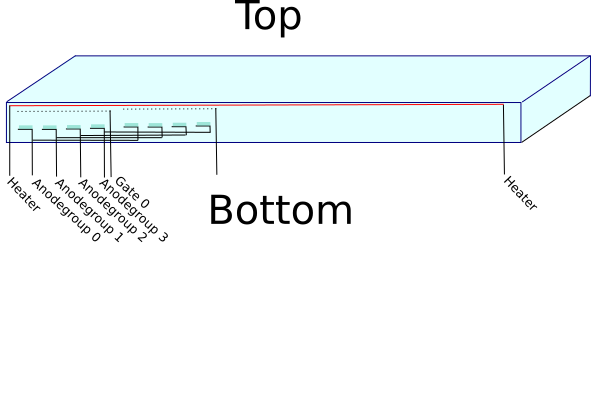

# LibVfd

LibVfd is a library that helps getting salvaged Vacuum Fluorescence
Displays (VFDs) to work using an arduino.

## Vacuum Fluorescent Displays (VFD)

VFDs usually emit green light. They often can be found in harddisc
recorders, dvd players, video cassette recorders, hifi audio devices,
dash panels, digital clocks, or at cash desks. They might come with
predefined symbols that usually include seven segment numbers and icons
i.e. for power-on, play, stop, pause, stereo, etc.  They might also come
in form of alpha-numeric dot-matrix displays. 

While Liquid Crystal Displays (LCDs) are more popular, VFDs still are
appreciated. Due to their high luminosity they are easier seen in bright
sunlight and do not require additional lighting at night.

## Creating driver circuits using LibVfd

When buying VFDs they usually come including a driver circuit, that can
be controlled using serial or parallel protocols like RS-232 or Hitachi
HD44780 (just like most LCDs do).

Sometimes VFDs are offered without the driving circuitry. Also when
salvaging VFDs from electronic devices, the driving electronics for them
often cannot be reused.

LibVfd provides schematics and perfboard-layouts for creating the driver
circuit required to run such bare-bone Vfds.

## How Vfds work and how to drive them

Vfds are directly heated vacuum tubes with an anode coated in a
phosphorescent layer.

Described starting from the viewer first there is a covering glasslayer.
Under the glass there are some heating wires, usually horizontally
running from left to right. In normal operation the heating wires are
not glowing or very barely glowing. 

## Building the Hardware 

